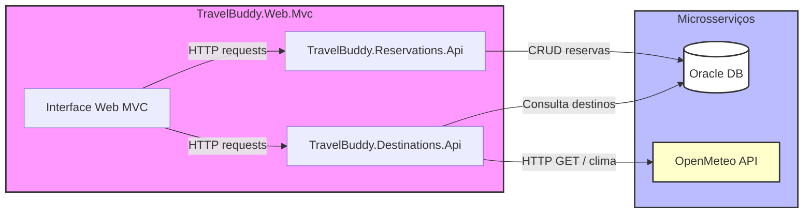

# 🌍 TravelBuddy

## 📌 Sobre o Projeto

**TravelBuddy** é uma plataforma .NET que centraliza reservas de viagens e fornece informações de destinos, incluindo previsão do tempo e detalhes turísticos. O sistema segue uma arquitetura de microsserviços, com projetos separados por responsabilidade para maior escalabilidade e manutenção.

### Estrutura de Projetos

| Camada               | Projeto                                    | Função                                                   |
| -------------------- | ------------------------------------------ | -------------------------------------------------------- |
| APIs                 | **TravelBuddy.Destinations.Api**           | Fornece informações de destinos e clima                  |
| APIs                 | **TravelBuddy.Reservations.Api**           | Gerencia criação e consulta de reservas                  |
| Aplicação / Domínio  | **TravelBuddy.Application**                | Contratos e orquestração de casos de uso                 |
| Persistência         | **TravelBuddy.Infrastructure.Persistence** | DbContext, repositórios e mapeamentos (EF Core + Oracle) |
| Integrações externas | **TravelBuddy.Infrastructure.Integration** | Clientes HTTP para APIs externas (ex.: OpenMeteo)        |
| Contratos            | **TravelBuddy.Shared.Contracts**           | DTOs compartilhados entre camadas                        |
| Interface Web        | **TravelBuddy.Web.Mvc**                    | UI interna para criar, listar e consultar reservas       |

> Observação: o sistema contém duas APIs e um front-end MVC para uso interno; não há módulo de pagamento ou catálogo de produtos.

---

## 🏢 Funcionalidade da Aplicação

A aplicação foi projetada para uso interno:

* Consultar destinos e previsão do tempo antes de criar reservas.
* Registrar reservas com detalhes do cliente, datas e quantidade de pessoas.
* Visualizar, atualizar e excluir reservas via interface web ou APIs.
* Todas as operações utilizam as APIs dedicadas, garantindo separação clara de responsabilidades.

---

## 🔗 Endpoints Principais

### 👥 Reservas (API Reservations)

| Método | Rota                   | Descrição               | Status Esperado               |
| ------ | ---------------------- | ----------------------- | ----------------------------- |
| GET    | /api/reservations      | Lista todas as reservas | 200 OK                        |
| GET    | /api/reservations/{id} | Consulta reserva por ID | 200 OK / 404 Not Found        |
| POST   | /api/reservations      | Cria nova reserva       | 201 Created / 400 Bad Request |

### 🌆 Destinos (API Destinations)

| Método | Rota                     | Descrição                                    | Status Esperado        |
| ------ | ------------------------ | -------------------------------------------- | ---------------------- |
| GET    | /api/destinations/{city} | Retorna dados do destino e previsão do clima | 200 OK / 404 Not Found |

Exemplo de resposta JSON:

```json
{
  "id": "GUID-do-destino",
  "name": "Rio de Janeiro",
  "country": "Brasil",
  "description": "Cidade maravilhosa, famosa pelo Cristo Redentor",
  "averagePrice": 2200.00,
  "weather": {
    "temperature": 28,
    "condition": "Ensolarado"
  }
}
```

Se o destino não existir, a API retorna **404 Not Found**.

---

## 📋 Pré-requisitos

* .NET SDK 8.0+
* Oracle acessível (instância ou serviço) para persistência
* Ferramenta opcional para visualização de banco (DBeaver, SQL Developer, etc.)

---

## ⚙️ Como Instalar e Executar

1. **Clonar repositório**

```bash
git clone https://github.com/seu-usuario/travelbuddy.git
cd travelbuddy
```

2. **Configurar conexão Oracle**
   Edite `appsettings.json` das APIs:

```json
"ConnectionStrings": {
  "OracleConnection": "User Id=<usuario>;Password=<senha>;Data Source=//<host>:<porta>/<ServiceName>;"
}
```

> É possível usar Secret Manager ou variáveis de ambiente para não versionar credenciais.

3. **Aplicar migrations e iniciar APIs**

```bash
# Atualiza schema Oracle
dotnet ef database update -p TravelBuddy.Infrastructure.Persistence -s TravelBuddy.Reservations.Api

# Iniciar API de Reservas
dotnet run --project TravelBuddy.Reservations.Api

# Iniciar API de Destinos em outro terminal
dotnet run --project TravelBuddy.Destinations.Api
```

4. **Acessar Swagger**

* API de Reservas: `http://localhost:{porta}/swagger`
* API de Destinos: `http://localhost:{porta}/swagger`

> As portas podem variar conforme `launchSettings.json`.

---

## ✅ Fluxo de Uso Sugerido

1. **Consultar destino**

```
GET /api/destinations/Rio%20de%20Janeiro
```

Resposta: dados do destino + previsão do tempo.

2. **Criar reserva**

```
POST /api/reservations
Content-Type: application/json

{
  "destinationId": "GUID-do-destino",
  "customerName": "Maria Oliveira",
  "travelDate": "2025-09-15",
  "numberOfPeople": 3,
  "totalPrice": 6600.00
}
```

Resposta: **201 Created** com ID da reserva.

3. **Consultar reserva criada**

```
GET /api/reservations/{id}
```

---

## 📐 Princípios SOLID Aplicados

* **SRP — Single Responsibility Principle**
  Cada classe tem responsabilidade única: controllers lidam com HTTP, serviços com regras de negócio, repositórios com persistência e clientes HTTP com integrações externas.

* **OCP — Open/Closed Principle**
  Serviços dependem de interfaces (`IReservationRepository`, `IOpenMeteoClient`) e podem ser estendidos sem alterar código existente.

* **DIP — Dependency Inversion Principle**
  Camadas de alto nível dependem de abstrações; implementações concretas são injetadas via DI, mantendo baixo acoplamento.

---

## 🧭 Estrutura Geral do Projeto

```
travelbuddy/
├── TravelBuddy.Application
├── TravelBuddy.Domain
├── TravelBuddy.Infrastructure.Persistence
├── TravelBuddy.Infrastructure.Integration
├── TravelBuddy.Shared.Contracts
├── TravelBuddy.Destinations.Api
├── TravelBuddy.Reservations.Api
└── TravelBuddy.Web.Mvc
```

---

## 🧪 Boas Práticas Implementadas

* Swagger habilitado nas APIs (`/swagger`).
* Mensagens de erro claras e consistentes (400/404/201).
* DTOs dedicados para desacoplar camadas.
* Injeção de dependência configurada para serviços, repositórios e integrações externas.
* Configurações flexíveis via `launchSettings.json` e `appsettings*.json`.

---

## 🖼 System Design



## 📌 Autor:
[Letícia Zago de Souza] – www.linkedin.com/in/letícia-zago-de-souza
